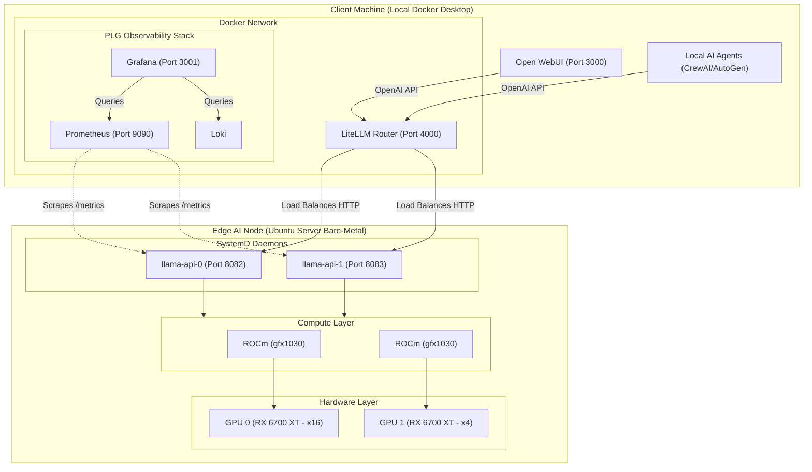

# 🚀 Edge AI Node: Bare-Metal Multi-GPU Inference Cluster

[](LICENSE)
[](docs/HARDWARE_INVENTORY.md)
[-red.svg)](docs/ARCHITECTURAL_DECISIONS.md)
[-orange.svg)](scripts/setup_replica_services.sh)
[](docker/litellm/)
[](docker/plg-stack/)

A high-performance, cost-effective private AI inference cluster running large language models (LLMs) locally on consumer-grade AMD GPUs. Designed for offline inference, continuous batching, and integration into autonomous agent workflows (e.g., CrewAI, AutoGen, OpenClaw).

---

## 1. Project Overview & Architectural Pivot

* **The Pivot from Proxmox to Bare-Metal Ubuntu:** The initial architecture explored virtualizing the cluster on Proxmox VE. However, consumer-grade motherboards (such as the Asus ROG Strix B450-F) impose severe PCIe lane bifurcations (x16 / x4). Introducing a hypervisor abstraction layer between the OS and the GPUs degraded DMA throughput and introduced kernel panics during multi-GPU handshakes.
* **Bare-Metal Decision:** The inference node runs on **bare-metal Ubuntu Server (26.04 LTS)** to ensure direct, uninhibited I/O access to the PCIe bus (`/dev/kfd` and `/dev/dri`). This eliminates virtualization latency and guarantees maximum memory bandwidth for tensor compute.

---

## 2. System Architecture

* **Hardware Foundation:**
  * **Motherboard:** Asus ROG Strix B450-F Gaming II (Primary PCIe 3.0 x16, Secondary PCIe 3.0 x4 via chipset).
  * **Compute Accelerators:** 2x AMD Radeon RX 6700 XT (12GB GDDR6 VRAM each, Navi 22 / gfx1030 silicon, 24GB VRAM total).
  * **CPU & Memory:** AMD Ryzen 5 PRO 2600 (6C/12T) with **4GB DDR4 System RAM** and 15GB Swap.
  * *Design note:* Due to the tight 4GB physical host RAM, the edge node acts strictly as a dedicated inference appliance. All orchestration and reverse-proxy services are offloaded to the client machine.
* **Compute Stack & ROCm Workarounds:**
  * AMD ROCm stack configured with `export HSA_OVERRIDE_GFX_VERSION=10.3.0` to force official compute support on consumer RDNA2 silicon.
  * Natively compiled `llama.cpp` with `GGML_HIPBLAS=ON` and custom Flash Attention kernel adjustments to prevent driver-level `max_blocks_per_sm` allocation crashes.
* **Parallelism Strategy (Replica vs. Pipeline):**
  * Rather than splitting a single model across GPUs (Pipeline Parallelism, which stalls on the secondary PCIe 3.0 x4 link), the cluster runs **Replica Parallelism**.
  * Two independent instances of Meta-Llama-3.1-8B-Instruct run concurrently: GPU 0 on port `8082` and GPU 1 on port `8083`.
* **Client Gateway & Routing:**
  * **LiteLLM Router** running locally via Docker Desktop (`localhost:4000`), load-balancing OpenAI API requests across both edge GPUs using a dynamic `least-busy` algorithm.
  * **Open WebUI** running on `localhost:3000` for conversational interaction.
* **Observability (Dashboards-as-Code):**
  * A full PLG stack (Prometheus, Loki, Grafana) deployed via Docker Compose (`localhost:3001`).
  * Grafana dashboards and Prometheus data sources are auto-provisioned declaratively from Git repository configs.

---

## 3. Architecture Diagram



---

## 4. Repository Structure

```text
├── config/
│   └── rocm-override.sh                  # Kernel environment variables for RDNA2
├── docker/
│   ├── litellm/
│   │   ├── config.yaml                   # LiteLLM router configuration (least-busy)
│   │   └── docker-compose.yml            # Gateway compose service with extra_hosts mapping
│   └── plg-stack/
│       ├── docker-compose.yml            # Prometheus, Loki, Grafana stack definition
│       ├── prometheus.yml                # Metric scrape targets
│       └── grafana/
│           ├── dashboards/               # Exported dashboard models (llama.cpp, node-exporter)
│           └── provisioning/             # Declarative datasource & dashboard provisioning
├── docs/
│   ├── ARCHITECTURAL_DECISIONS.md        # Detailed engineering logs & pivot rationale
│   ├── HARDWARE_INVENTORY.md             # Verified bare-metal hardware telemetry
│   └── LESSONS_LEARNED.md                # Benchmarks, container gotchas & technical insights
├── scripts/
│   ├── build_llama.sh                    # Native C++ compilation with ROCm/HIPBLAS
│   ├── install_rocm.sh                   # ROCm package repository setup & group permissions
│   ├── setup_os.sh                       # OS provisioning and lm-sensors bug fixes
│   ├── setup_replica_services.sh         # Systemd service generator for dual-GPU replica
│   ├── start_llama.sh                    # Dockerized fallback runner
│   └── start_webui.sh                    # Open WebUI startup helper
├── tests/
│   └── load_test.ps1                     # Concurrent multi-stream stress testing script
├── .env.example                          # Environment variable configuration template
├── .gitignore                            # Excludes build artifacts, models, .env & private files
└── LICENSE                               # MIT License
```

---

## 5. In-Depth Engineering Documentation

For comprehensive technical post-mortems and engineering logs, refer to the documentation in [`docs/`](docs/):

* [**Architectural Decisions Log**](docs/ARCHITECTURAL_DECISIONS.md) — Rationale for bare-metal Ubuntu vs. Proxmox, Pipeline vs. Replica parallelism, resolving ROCm kernel deadlocks, and AMD repo CDN sinkholes.
* [**Hardware Inventory & Telemetry**](docs/HARDWARE_INVENTORY.md) — CPU/RAM constraints, Asus B450 PCIe topology, and physical GPU bus addresses.
* [**Lessons Learned & Benchmarks**](docs/LESSONS_LEARNED.md) — Continuous batching throughput dynamics, Grafana volume persistence, and AI gateway API key schemas.

---

## 6. Quickstart & Local Setup

### Step 1: Provision the Bare-Metal Ubuntu Node
On the Ubuntu server:
```bash
# 1. Update OS and tune hardware sensors
bash scripts/setup_os.sh

# 2. Install ROCm compute stack and apply gfx1030 override
bash scripts/install_rocm.sh
sudo reboot

# 3. Build llama.cpp natively
bash scripts/build_llama.sh

# 4. Generate and start systemd replica services (Ports 8082 & 8083)
bash scripts/setup_replica_services.sh
```

### Step 2: Configure and Launch Client Stack
On your client workstation (Windows / macOS / Linux with Docker):

1. Copy the environment configuration template:
   ```bash
   cp .env.example .env
   ```
2. Open `.env` and set `EDGE_NODE_HOST` to your node's IP address (e.g. Tailscale or Local LAN IP):
   ```env
   EDGE_NODE_HOST=100.x.y.z
   GRAFANA_ADMIN_PASSWORD=admin
   ```
3. Start the LiteLLM load balancer:
   ```bash
   cd docker/litellm && docker compose up -d && cd ../..
   ```
4. Start the Prometheus & Grafana observability stack:
   ```bash
   cd docker/plg-stack && docker compose up -d && cd ../..
   ```

### Step 3: Run the Concurrent Load Test
Verify multi-GPU load balancing and continuous batching by firing concurrent long-context requests:
```powershell
powershell -ExecutionPolicy Bypass -File tests/load_test.ps1
```
Open **Grafana** at `http://localhost:3001` (user: `admin`) to observe real-time GPU compute throughput and prediction queues.

---

## 7. Discovered Benchmarks

* **Single-Stream Baseline:** ~50–53 tokens/sec on a single RX 6700 XT running `Meta-Llama-3.1-8B-Instruct-Q4_K_M`.
* **Continuous Batching Multiplier:** Under 4 concurrent heavy prompt streams routed through LiteLLM, `llama.cpp`'s continuous batching dynamically coalesced execution, yielding ~40 t/s per stream per card.
* **Cluster Aggregate Throughput:** Reached **~160 tokens/sec** combined throughput across both cards without cross-PCIe bus contention.

---

## 8. Known Constraints & Roadmap

* [x] Bare-metal Ubuntu 26.04 LTS migration.
* [x] ROCm RDNA2 hardware override validation (`gfx1030`).
* [x] Native `llama.cpp` dual-GPU systemd daemon deployment.
* [x] LiteLLM least-busy routing with Dashboards-as-Code observability.
* [ ] **vLLM Migration (Pending):** Transition from `llama.cpp` to containerized `vllm-rocm` with `--pipeline-parallel-size 2` and eager-mode kernel execution.

---

## 9. License

This project is open-source software licensed under the [MIT License](LICENSE).
