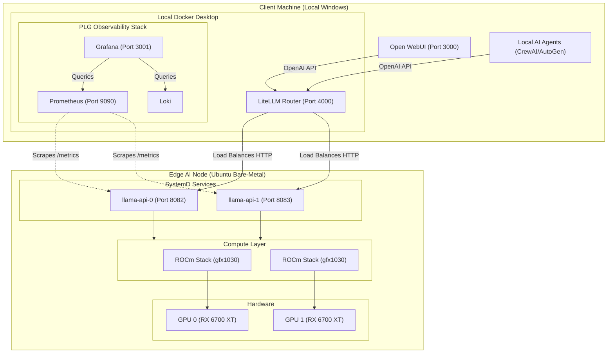

# Project State & Architecture

## 1. Project Overview
This project is an edge AI inference node designed to run large language models (LLMs) entirely locally on consumer-grade AMD GPUs. It provisions a high-performance, cost-effective private cloud capable of offline inference and integration into a broader DevSecOps automation pipeline.

## 2. Current Architecture
- **Hardware:** Asus ROG Strix B450-F Gaming II Motherboard (PCIe bottleneck: x16/x4 bifurcation), 2x AMD Radeon RX 6700 XT (12GB VRAM each), AMD Ryzen 5 PRO 2600 (6C/12T), **4GB DDR4 System RAM** (with 15GB Swap), 120GB SATA SSD.
- **Operating System:** Bare-metal Ubuntu Server 26.04 LTS (shifted from a Proxmox hypervisor model to optimize for native PCIe device passthrough).
- **Compute Layer:** AMD ROCm stack leveraging the `HSA_OVERRIDE_GFX_VERSION=10.3.0` workaround to force support for the RDNA2 (gfx1030) architecture.
- **AI Engine (Current):** `llama.cpp` natively compiled with `GGML_HIPBLAS=ON` and patched to bypass driver-level memory allocation bugs (`max_blocks_per_sm`).
- **Parallelism Strategy:** Optimized for *Replica Parallelism* (Horizontal Scaling) running two independent 8B models concurrently. GPU 0 runs on port 8082, GPU 1 runs on port 8083. Pipeline Parallelism was abandoned due to the PCIe 3.0 x4 bottleneck on the second slot causing P2P memory crashes.
- **Load Balancer:** `LiteLLM` running locally in Windows Docker Desktop (`localhost:4000`), routing standard OpenAI API requests across the two edge GPUs using a `least-busy` strategy.
- **Frontend / Orchestration:** Docker-based Open WebUI running on the local Windows client (`localhost:3000`), natively integrated with the LiteLLM load balancer.
- **Observability Stack:** A PLG stack (Prometheus, Loki, Grafana) deployed via `docker-compose` on the local machine (`localhost:3001`). Dashboards and metrics scraping are defined entirely as code using Grafana Auto-Provisioning.

### Architecture Diagram

## 3. Discovered State (Successfully Built & Tested)
- **OS Foundation:** Ubuntu installed, packages updated, and `lm-sensors` configured to bypass Asus hardware sensor mapping bugs.
- **ROCm Drivers:** The official AMD ROCm repository is registered and the core compute stack is installed natively via `apt`.
- **System Services:** Two highly-available `systemd` bare-metal daemons (`llama-api-0` and `llama-api-1`) are managing the inference endpoints.
- **Inference Benchmark:** The cluster achieves ~50-53 tokens/sec per stream. Under heavy concurrent load, continuous batching pushes the aggregate cluster throughput up to ~160 tokens/sec.
- **Observability Data:** Prometheus successfully tracks multi-GPU workloads, scraping the `llama-api` endpoints to visualize inference performance, VRAM consumption, and predict queues.

## 4. Known Issues & Blockers
- **Playwright/Browser Tooling:** Transient 404 errors attempting to retrieve Google Docs due to Microsoft CDN instability.
- **AMD Repo Sink Issues:** The AMD `apt` repositories occasionally return `404` or hash mismatches right after a release; the `rm -rf /var/lib/apt/lists/* && apt clean` workaround is required to force a sync.
- **Hardware Constraints:** The motherboard does not support x8/x8 PCIe lane splitting. The lack of proper bifurcation disables advanced multi-GPU clustering algorithms (like tensor parallelism).

## 5. vLLM Migration Plan & Next Steps (Pending)
1. **Cleanup:** Stop the `llama-api` systemd services to free up VRAM and TCP ports.
2. **vLLM Compatibility Check:** Verify that vLLM's ROCm wheels support `gfx1030` out of the box, or compile vLLM from source using the `HSA_OVERRIDE_GFX_VERSION` flags.
3. **Containerized vLLM Deployment:** Spin up the `vllm/vllm-openai` ROCm Docker image, mounting `/dev/kfd` and `/dev/dri`, pointing it to the `~/ai-models` directory.
4. **Update LiteLLM:** Adjust the `config.yaml` to route traffic to the new vLLM endpoints instead of `llama.cpp`.
5. **Update Observability:** Wire Prometheus to scrape the vLLM metrics endpoint to seamlessly maintain observability in Grafana.
